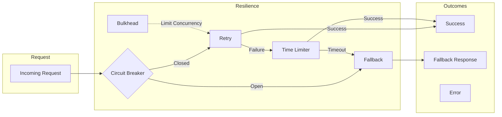
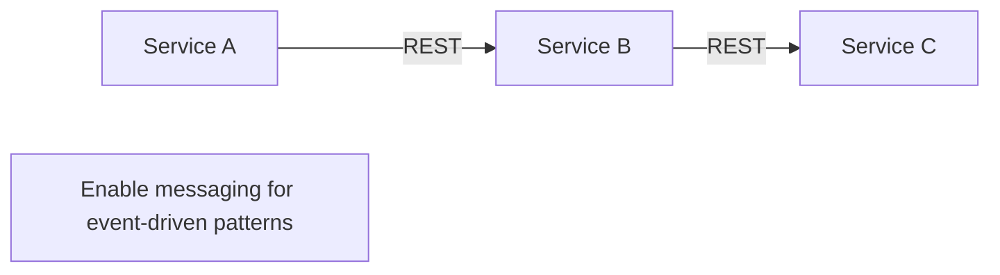
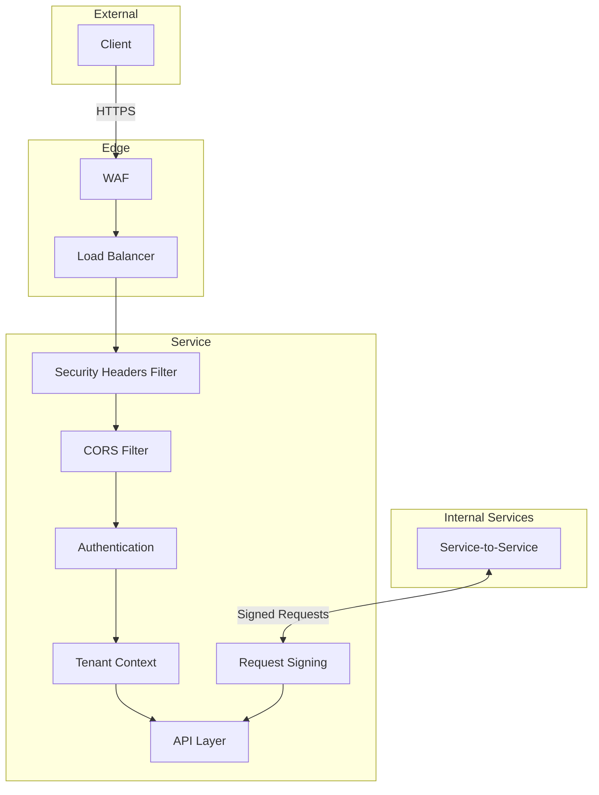

# Architecture Overview

## Service Architecture

```mermaid
flowchart TB
    subgraph External
        Client[Client Apps]
        DD[Datadog]
    end

    subgraph Kubernetes
        subgraph Service["${{values.name}}"]
            API[REST API :8080]
            Mgmt[Management :8081]
        end

        
        subgraph Data
            DB[(Database)]
        end
        

        
        subgraph Cache
            Redis[(Redis)]
        end
        

        
        subgraph Messaging
            SQS[SQS Queue]
            
            SNS[SNS Topic]
            
        end
        
    end

    Client --> API
    Mgmt --> DD

    
    API --> DB
    

    
    API --> Redis
    

    
    API --> SNS
    SNS --> SQS
    
    SQS --> API
    
```

## Request Flow

```mermaid
sequenceDiagram
    participant C as Client
    participant F as Filter Chain
    participant Ctrl as Controller
    participant Svc as Service
    
    participant DB as Database
    
    participant DD as Datadog

    C->>F: HTTP Request
    Note over F: Correlation ID
    Note over F: Tenant Context
    Note over F: Security Headers

    F->>Ctrl: Validated Request
    Note over Ctrl: @Timed
    Note over Ctrl: @AuditLog

    Ctrl->>Svc: Business Logic
    
    Svc->>DB: Query/Persist
    DB-->>Svc: Result
    

    Svc-->>Ctrl: Response
    Ctrl-->>F: ApiResponse<T>
    F-->>C: JSON Response

    F--)DD: Trace + Metrics
```

## Component Diagram

```mermaid
graph LR
    subgraph Controller Layer
        AC[ApiController]
        EC[ExampleController]
        
        AIC[AiController]
        
    end

    subgraph Service Layer
        ES[ExampleService]
        
        AIS[AiService]
        
        OS[OutboxService]
        AS[AuditService]
    end

    subgraph Infrastructure
        LS[LockService]
        IS[IdempotencyService]
        FS[FallbackService]
    end

    subgraph Config
        OC[OpenApiConfig]
        SC[SecurityConfig]
        LC[LoggingConfig]
        AC2[AsyncConfig]
    end

    EC --> ES
    
    AIC --> AIS
    
    ES --> OS
    ES --> AS
    ES --> LS
```

## Resilience Patterns



## Data Flow (Event-Driven)


```mermaid
flowchart LR
    subgraph Producer Service
        API[API Handler]
        TX[(Transaction)]
        OB[Outbox Table]
        OP[Outbox Processor]
    end

    subgraph Message Broker
        
        SNS[SNS Topic]
        
        SQS[SQS Queue]
        DLQ[Dead Letter Queue]
    end

    subgraph Consumer Service
        LC[Listener]
        CS[Consumer Service]
    end

    API -->|1. Business Logic| TX
    TX -->|2. Write Event| OB
    OP -->|3. Poll & Publish| SNSSQS
    
    SNS -->|4. Fan-out| SQS
    
    SQS -->|5. Receive| LC
    LC -->|6. Process| CS
    SQS -->|Failed| DLQ
```




## Deployment Architecture

```mermaid
flowchart TB
    subgraph GitHub
        Repo[Repository]
        Actions[GitHub Actions]
    end

    subgraph Container Registry
        ECR[ECR]
    end

    subgraph Kubernetes Cluster
        subgraph Namespace
            Deploy[Deployment]
            SVC[Service]
            HPA[HPA]
            PDB[PDB]
        end

        subgraph Observability
            DDAgent[Datadog Agent]
        end
    end

    subgraph AWS
        
        Aurora[(Aurora)]
        
        
        DDB[(DynamoDB)]
        
        
        ElastiCache[(ElastiCache)]
        
        SM[Secrets Manager]
    end

    Repo -->|Push| Actions
    Actions -->|Build & Push| ECR
    Actions -->|Deploy| Deploy
    ECR --> Deploy
    SM --> Deploy
    Deploy --> SVC
    HPA --> Deploy
    PDB --> Deploy
    DDAgent --> Deploy

    
    Deploy --> Aurora
    
    
    Deploy --> DDB
    
    
    Deploy --> ElastiCache
    
```

## Security Model


